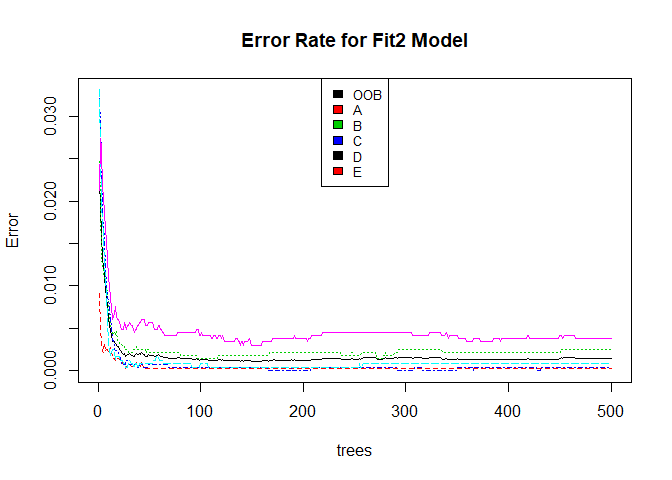

<style type="text/css">

body{ /* Normal  */
      font-size: 11px;
  }
td {  /* Table  */
  font-size: 10px;
}
h1.title {
  font-size: 22px;
  /*color: DarkBlue;*/
}
h1 { /* Header 1 */
  font-size: 18px;
  /*color: DarkBlue;*/
}
h2 { /* Header 2 */
  font-size: 14px;
  /*color: DarkBlue;*/
}
h3 { /* Header 3 */
  font-size: 12px;
  /*color: DarkBlue;*/
}
code.r{ /* Code block */
    font-size: 11px;
}
pre { /* Code block - determines code spacing between lines */
    font-size: 11px;
}
</style>


#### Introduction

Using data from the Human Activity Recognition dataset (reference 2), proper and improper form for completing dumbbell curls 
is "learned" using a Random Forest algorithm and the fit models are used to predict dumbbell performance given a test set.  

The type of forms captured in the activity dataset are:

A - According to specification  
B - Throwing elbows to front  
C - Raising only halfway  
D - Lowering only halfway  
E - Throwing hips to front  

In an attempt to explore over/under fitting, a random forest algorithm is used to fit two models:  One model uses a relatively 
full set of input data from the Human Activity Recognition dataset, whereas a second model uses the minimum optimum inputs needed 
to produce reasonable accuracy.  


#### Data Processing and Exploratory Data Analysis

The training and testing data are downloaded and processed to form train, validation, and test sets.  Data inputs consisting of blank
and NA values are removed from the datasets.  Also, for the purposes of the current evaluation, inputs such as name and date are not 
needed and so are also removed.  

The datasets traindata1 and testdata1 retain 53 inputs for modeling.  To form minimized training and test sets (traindata2 and testdata2), 
the initial 53 inputs are iteratively modeled and reduced to four by choosing inputs with optimum Gini indices.


```r
  # Load sensor data
  train=read.csv("https://d396qusza40orc.cloudfront.net/predmachlearn/pml-training.csv")
  test=read.csv("https://d396qusza40orc.cloudfront.net/predmachlearn/pml-testing.csv")

  # Do some data processing
  traindata<-subset(train,train$kurtosis_roll_belt=="")
  traindata1<-traindata[,c(7:11,37:49,60:68,84:86,102,113:124,140,151:160)]
  traindata2<-traindata[,c(7,8,10,123,160)]

  testdata<-subset(test,toString(test$kurtosis_roll_belt)!="NA")
  colnames(testdata)[colnames(testdata)=="problem_id"]<-"classe"
  testdata1<-testdata[,c(7:11,37:49,60:68,84:86,102,113:124,140,151:160)]
  testdata2<-testdata[,c(7,8,10,123,160)]
  
  # Make training, validation, and test datasets
  inTrain1=createDataPartition(traindata1$classe,p=0.75,list=FALSE)
  trainset1=traindata1[inTrain1,]; validationset1=traindata1[-inTrain1,]; testset1<-testdata1
  
  inTrain2=createDataPartition(traindata2$classe,p=0.75,list=FALSE)
  trainset2=traindata2[inTrain2,]; validationset2=traindata2[-inTrain2,]; testset2<-testdata2
```

The inputs retained for train and test sets 1 are:


```r
print(colnames(traindata1))
```

```
##  [1] "num_window"           "roll_belt"            "pitch_belt"          
##  [4] "yaw_belt"             "total_accel_belt"     "gyros_belt_x"        
##  [7] "gyros_belt_y"         "gyros_belt_z"         "accel_belt_x"        
## [10] "accel_belt_y"         "accel_belt_z"         "magnet_belt_x"       
## [13] "magnet_belt_y"        "magnet_belt_z"        "roll_arm"            
## [16] "pitch_arm"            "yaw_arm"              "total_accel_arm"     
## [19] "gyros_arm_x"          "gyros_arm_y"          "gyros_arm_z"         
## [22] "accel_arm_x"          "accel_arm_y"          "accel_arm_z"         
## [25] "magnet_arm_x"         "magnet_arm_y"         "magnet_arm_z"        
## [28] "roll_dumbbell"        "pitch_dumbbell"       "yaw_dumbbell"        
## [31] "total_accel_dumbbell" "gyros_dumbbell_x"     "gyros_dumbbell_y"    
## [34] "gyros_dumbbell_z"     "accel_dumbbell_x"     "accel_dumbbell_y"    
## [37] "accel_dumbbell_z"     "magnet_dumbbell_x"    "magnet_dumbbell_y"   
## [40] "magnet_dumbbell_z"    "roll_forearm"         "pitch_forearm"       
## [43] "yaw_forearm"          "total_accel_forearm"  "gyros_forearm_x"     
## [46] "gyros_forearm_y"      "gyros_forearm_z"      "accel_forearm_x"     
## [49] "accel_forearm_y"      "accel_forearm_z"      "magnet_forearm_x"    
## [52] "magnet_forearm_y"     "magnet_forearm_z"     "classe"
```

The inputs retained for train and test sets 2 are:


```r
print(colnames(traindata2))
```

```
## [1] "num_window"    "roll_belt"     "yaw_belt"      "pitch_forearm"
## [5] "classe"
```


#### Training Models and Results

The RandomForest() function is used to fit both training sets and the confusionMatrix() function is used to 
demonstrate performance with the validation sets.  The results of testing the fit1 model (data sets 1) to the
validation set are shown below.  The model performs very well with an accuracy over 0.99 with the validation 
set.


```r
  # learn train set 1
  set.seed(298374)
  fit1<-randomForest(classe~.,data=trainset1,importance=FALSE)
  # predictions validation set 1
  validationsetpredictions1<-predict(fit1,newdata=validationset1)
  confusionMatrix(validationsetpredictions1,validationset1$classe)
```

```
## Confusion Matrix and Statistics
## 
##           Reference
## Prediction    A    B    C    D    E
##          A 1367    1    0    0    0
##          B    0  925    0    0    0
##          C    0    3  838    2    0
##          D    0    0    0  784    1
##          E    0    0    0    0  881
## 
## Overall Statistics
##                                          
##                Accuracy : 0.9985         
##                  95% CI : (0.997, 0.9994)
##     No Information Rate : 0.2847         
##     P-Value [Acc > NIR] : < 2.2e-16      
##                                          
##                   Kappa : 0.9982         
##                                          
##  Mcnemar's Test P-Value : NA             
## 
## Statistics by Class:
## 
##                      Class: A Class: B Class: C Class: D Class: E
## Sensitivity            1.0000   0.9957   1.0000   0.9975   0.9989
## Specificity            0.9997   1.0000   0.9987   0.9998   1.0000
## Pos Pred Value         0.9993   1.0000   0.9941   0.9987   1.0000
## Neg Pred Value         1.0000   0.9990   1.0000   0.9995   0.9997
## Prevalence             0.2847   0.1935   0.1745   0.1637   0.1837
## Detection Rate         0.2847   0.1926   0.1745   0.1633   0.1835
## Detection Prevalence   0.2849   0.1926   0.1756   0.1635   0.1835
## Balanced Accuracy      0.9999   0.9978   0.9994   0.9986   0.9994
```

Results for testing the fit2 model (data sets 2) to the validation set are shown below.  The model also performs 
very well with an accuracy of greater than 0.99 on the validation set.  It can be seen that performance remains 
very good even with a significant reduction in the number of inputs, indicating that within the perspective of 
generality in the model, the model fit1 is likely over fit.


```r
  # learn train set 2
  set.seed(298374)
  fit2<-randomForest(classe~.,data=trainset2,importance=FALSE)
  # predictions validation set 2
  validationsetpredictions2<-predict(fit2,newdata=validationset2)
  confusionMatrix(validationsetpredictions2,validationset2$classe)
```

```
## Confusion Matrix and Statistics
## 
##           Reference
## Prediction    A    B    C    D    E
##          A 1367    2    0    0    0
##          B    0  927    0    0    0
##          C    0    0  838    1    0
##          D    0    0    0  785    1
##          E    0    0    0    0  881
## 
## Overall Statistics
##                                           
##                Accuracy : 0.9992          
##                  95% CI : (0.9979, 0.9998)
##     No Information Rate : 0.2847          
##     P-Value [Acc > NIR] : < 2.2e-16       
##                                           
##                   Kappa : 0.9989          
##                                           
##  Mcnemar's Test P-Value : NA              
## 
## Statistics by Class:
## 
##                      Class: A Class: B Class: C Class: D Class: E
## Sensitivity            1.0000   0.9978   1.0000   0.9987   0.9989
## Specificity            0.9994   1.0000   0.9997   0.9998   1.0000
## Pos Pred Value         0.9985   1.0000   0.9988   0.9987   1.0000
## Neg Pred Value         1.0000   0.9995   1.0000   0.9998   0.9997
## Prevalence             0.2847   0.1935   0.1745   0.1637   0.1837
## Detection Rate         0.2847   0.1930   0.1745   0.1635   0.1835
## Detection Prevalence   0.2851   0.1930   0.1747   0.1637   0.1835
## Balanced Accuracy      0.9997   0.9989   0.9999   0.9992   0.9994
```

A graph of error vs. number of trees is shown below for fit2.  The graph shows that the predicted error is very 
low, i.e., under 0.01.


```r
  plot(fit2,main="Error Rate for Fit2 Model")
  legend("top",colnames(fit2$err.rate),col=1:4,cex=0.8,fill=1:4)
```

<!-- -->


The predictions for the test set using the fit1 model are:


```r
  # predictions test set 1
  testsetpredictions1<-predict(fit1,newdata=testset1)
  testsetpredictions1  
```

```
##  1  2  3  4  5  6  7  8  9 10 11 12 13 14 15 16 17 18 19 20 
##  B  A  B  A  A  E  D  B  A  A  B  C  B  A  E  E  A  B  B  B 
## Levels: A B C D E
```

The predictions for the test set using the fit2 model are:


```r
  # predictions test set 2
  testsetpredictions2<-predict(fit2,newdata=testset2)
  testsetpredictions2  
```

```
##  1  2  3  4  5  6  7  8  9 10 11 12 13 14 15 16 17 18 19 20 
##  B  A  B  A  A  E  D  B  A  A  B  C  B  A  E  E  A  B  B  B 
## Levels: A B C D E
```


For reference, several plots cross referencing the inputs used for the fit2 model are shown below.  The 
plots show clear separations in the inputs selected through optimizing the fit2 model.


```r
  qplot(num_window,pitch_forearm,colour=classe,data=traindata)
```

<!-- -->

```r
  qplot(roll_belt,yaw_belt,colour=classe,data=traindata)
```

<!-- -->

```r
  qplot(pitch_forearm,roll_belt,colour=classe,data=traindata)
```

<!-- -->


#### Summary

The results for the test set for both fit models are equivalent and are:

1  2  3  4  5  6  7  8  9 10 11 12 13 14 15 16 17 18 19 20   
B  A  B  A  A  E  D  B  A  A  B  C  B  A  E  E  A  B  B  B

The evaluation shows that the randomForest() function can provide good fit for predicting dumbbell performance 
given the Human Activity Recognition dataset.  Evaluation to determine optimum inputs for use in the prediction model 
shows that relatively few inputs are needed for accurate predictions.


#### References

Brian Caffo, Jeff Leek, Roger Peng, 2014, Github Repository /courses/08_PracticalMachineLearning, 
  https://github.com/bcaffo/courses

Velloso, E.; Bulling, A.; Gellersen, H.; Ugulino, W.; Fuks, H. Qualitative Activity Recognition of Weight Lifting Exercises. Proceedings of 4th 
  International Conference in Cooperation with SIGCHI (Augmented Human '13) . Stuttgart, Germany: ACM SIGCHI, 2013. 

"Tree-Based Models", https://www.statmethods.net/advstats/cart.html, Last accessed 6/10/2019


